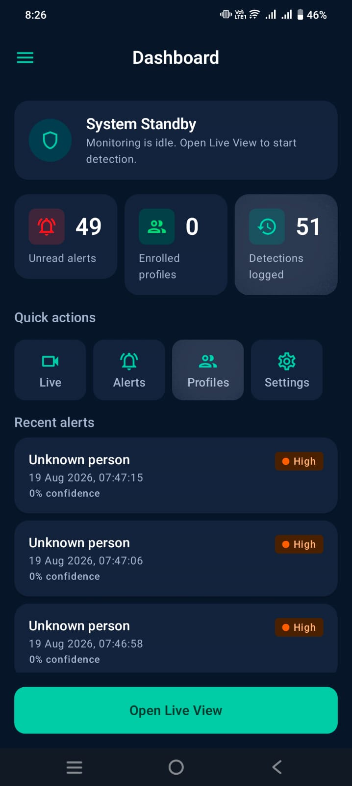
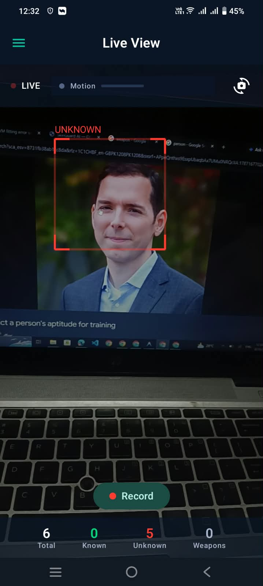
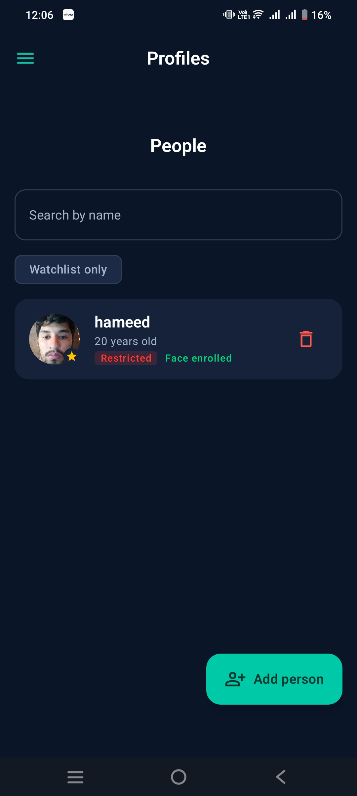
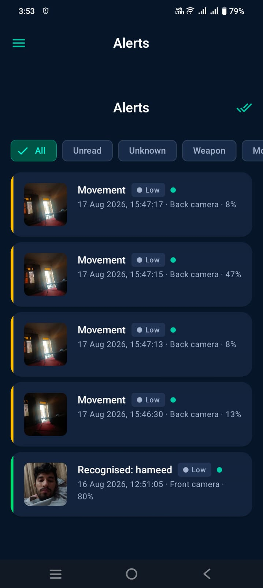
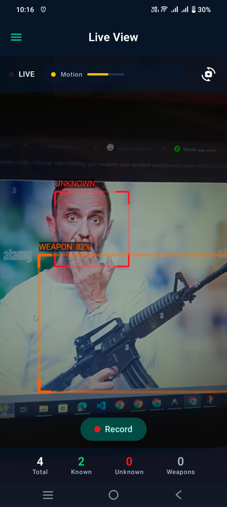
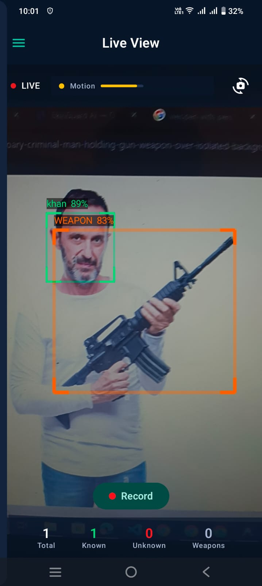
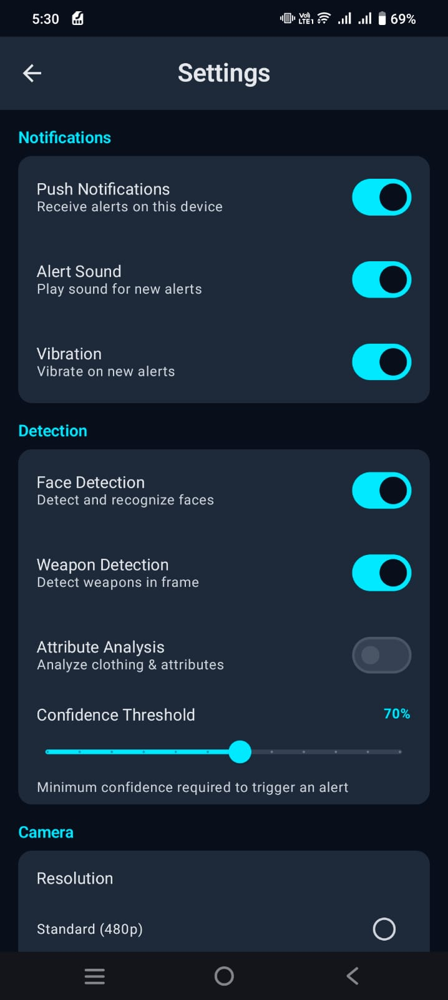

<div align="center">


<br/><br/>

```
███████╗███████╗ ██████╗██╗   ██╗██████╗ ███████╗
██╔════╝██╔════╝██╔════╝██║   ██║██╔══██╗██╔════╝
███████╗█████╗  ██║     ██║   ██║██████╔╝█████╗  
╚════██║██╔══╝  ██║     ██║   ██║██╔══██╗██╔══╝  
███████║███████╗╚██████╗╚██████╔╝██║  ██║███████╗
╚══════╝╚══════╝ ╚═════╝ ╚═════╝ ╚═╝  ╚═╝╚══════╝
         V I S I O N
```

# 🔐 SecureVision

### On-Device Face Recognition & Threat Detection for Android

**Face recognition, weapon detection, and motion sensing — running entirely on the phone. No cloud, no account server, no network permission.**

<br/>

[](LICENSE)
[](https://developer.android.com)
[](https://kotlinlang.org)
[](https://developer.android.com/jetpack/compose)
[]()
[]()

<br/>

[**📱 Features**](#-features) • [**📸 Screenshots**](#-screenshots) • [**🏗 Architecture**](#-architecture) • [**🧠 AI Models**](#-ai-models) • [**🚀 Getting Started**](#-getting-started) • [**🚧 Limitations**](#-known-limitations)

</div>

---

## 📖 Overview

**SecureVision** turns an Android phone into a self-contained AI security camera. It performs real-time face recognition, weapon detection, and motion sensing using **on-device machine learning**, with no cloud dependency of any kind.

The privacy guarantee is structural rather than promissory: the app declares **three permissions** and the `INTERNET` permission is explicitly removed from the merged manifest. The app is *incapable* of transmitting data, not merely configured not to.

> Built as a Final Year Project for Mobile Application Development at CECOS University of IT & Emerging Sciences, Peshawar.

```
┌─────────────────────────────────────────────────────────────────┐
│                        HOW IT WORKS                             │
│                                                                 │
│   📷 Camera Frame (analysed every 200 ms)                       │
│        │                                                        │
│        ├──► 🧠 ML Kit Face Detection ──► Boxes + 5 landmarks    │
│        │         │                                              │
│        │         ├──► 🚦 Quality Gate (size / roll / yaw)      │
│        │         │         │                                    │
│        │         │         └──► 📐 Landmark Alignment           │
│        │         │                   │                          │
│        │         │              🤖 FaceNet TFLite               │
│        │         │              512-dim Embedding               │
│        │         │                   │                          │
│        │         │         ┌─────────▼──────────┐              │
│        │         │         │ Cosine Similarity  │              │
│        │         │         │ + Margin Check     │              │
│        │         │         │ + 4-Frame Voting   │              │
│        │         │         └─────────┬──────────┘              │
│        │         │                   │                          │
│        │    ✅ KNOWN            ❌ UNKNOWN                      │
│        │  (Green + name)      (Red + alarm)                     │
│        │                                                        │
│        ├──► 🔫 YOLOv8 Weapon Detection ──► Orange box + 🚨      │
│        └──► 🟡 Frame-difference Motion ──► Low-severity alert   │
│                                                                 │
└─────────────────────────────────────────────────────────────────┘
```

---

## ✨ Features

<table>
<tr>
<td width="50%">

### 🎥 Live Camera Monitoring
- CameraX preview with a 200 ms analysis cadence
- Front / back camera toggle and torch control
- Per-face ML Kit tracking IDs
- Live stats bar (Total / Known / Unknown / Weapons)
- Exposure compensation for indoor use

### 👤 Face Recognition
- **512-dimensional FaceNet** embeddings
- **Mandatory 5-point landmark alignment** before embedding
- Cosine similarity with a best-vs-second-best margin
- **4-frame voting window** with a short sticky-identity hold
- GREEN = recognised · RED = unknown · AMBER = still resolving

### 🔫 Weapon Detection
- YOLOv8 TFLite detector, single `Weapon` class
- Letterboxed 640 × 640 input, per-class NMS
- ORANGE bounding box + Critical alarm
- Weapon alarm cannot be pre-empted by a lesser alert

</td>
<td width="50%">

### 👥 Profile Management
- Enrol people by camera capture or gallery photo
- Photo + name + age + watchlist flag per profile
- Face quality gate enforced at enrolment
- Searchable grid, on-device storage only

### 🚨 Graded Alarm System
- **Low** (motion) · **Medium** (unknown face) · **Critical** (weapon)
- Synthesised alarm tones — no bundled audio assets
- Single de-duplication gate, 8 s window per alert kind
- Severity priority: a Critical alarm is never silenced by a lower one

### 📊 History & Recordings
- Alert history in Room with snapshot thumbnails
- Filters: All / Unread / Unknown / Weapon / Motion
- Silent video recording to internal storage
- Local notifications (no push service)

</td>
</tr>
</table>

### 🎯 Face Attributes — current status

The attribute pipeline is built and wired, but **only one signal is active in this build**. Attribute classifiers are optional assets; when a model is absent the attribute reports `null` — *not assessed* — and the UI renders "unknown" rather than inventing a value.

| Attribute | Status in this build | Source |
|---|---|---|
| Emotion (coarse) | ✅ Active | ML Kit smile probability → `smiling` / `neutral` |
| Age | ⬜ Not shipped | Needs `face_age.tflite` |
| Gender | ⬜ Not shipped | Needs `face_gender.tflite` |
| Beard | ⬜ Not shipped | Needs `face_beard.tflite` |
| Face mask | ⬜ Not shipped | Needs `face_mask.tflite` |

Drop any of those files into `ml/ml-attributes/src/main/assets/` and the loader picks them up automatically — see [`AttributeModel`](ml/ml-attributes/src/main/kotlin/com/securevision/ml/attributes/AttributeModelLoader.kt).

---

## 📸 Screenshots

> _Captured on a physical Android device._

<table>
<tr>
<td align="center" width="25%">

<br/><sub><b>🏠 Dashboard</b></sub>
</td>
<td align="center" width="25%">

<br/><sub><b>🎥 Live Camera</b></sub>
</td>
<td align="center" width="25%">

<br/><sub><b>👥 Profiles</b></sub>
</td>
<td align="center" width="25%">

<br/><sub><b>🚨 Alerts</b></sub>
</td>
</tr>
<tr>
<td align="center" width="25%">

<br/><sub><b>🔫 Weapon Alert</b></sub>
</td>
<td align="center" width="25%">

<br/><sub><b>🎬 Recordings</b></sub>
</td>
<td align="center" width="25%">

<br/><sub><b>⚙️ Settings</b></sub>
</td>
<td align="center" width="25%">
</td>
</tr>
</table>

---

## 🏗 Architecture

Clean Architecture + MVVM across **20 Gradle modules**, wired by convention plugins in a `build-logic/` composite build. Dependencies point inward only: presentation never reaches the data layer directly.

```
┌─────────────────────────────────────────────────────────────────────┐
│                         PRESENTATION                                │
│  feature-auth · feature-dashboard · feature-live · feature-profiles │
│  feature-alerts · feature-recordings · feature-history              │
│  feature-settings              ·               core-ui              │
├─────────────────────────────────────────────────────────────────────┤
│                            DOMAIN                                   │
│    core-domain — models, use cases, repository & engine contracts   │
│                     core-model  ·  core-common                      │
├─────────────────────────────────────────────────────────────────────┤
│                             DATA                                    │
│   core-data (Room, DataStore, file storage) · core-alerting         │
│   ml-face · ml-weapon · ml-motion · ml-attributes · ml-object       │
└─────────────────────────────────────────────────────────────────────┘
```

`:app` is the only module that sees both the domain contracts and their implementations — that is where the Hilt graph closes, and nowhere else.

### Module map

| Group | Modules |
|---|---|
| App | `app` |
| Core | `core-model` · `core-common` · `core-domain` · `core-data` · `core-alerting` · `core-ui` |
| Feature | `feature-auth` · `feature-dashboard` · `feature-live` · `feature-profiles` · `feature-alerts` · `feature-recordings` · `feature-history` · `feature-settings` |
| ML | `ml-face` · `ml-object` · `ml-weapon` · `ml-motion` · `ml-attributes` |

### Recognition pipeline

Order matters. The quality gate runs **before** alignment so that unusable crops never reach the model, and alignment is **mandatory** — an early prototype scored ~0.23 similarity for every subject precisely because it embedded unaligned crops.

```
ML Kit detection  →  Quality gate  →  Landmark alignment  →  FaceNet-512
                                                                  │
                    Multi-frame vote  ←  Cosine match + margin  ←──┘
```

---

## 🧠 AI Models

Both `.tflite` files are **excluded from the repository** (see [`.gitignore`](.gitignore)) — together they are ~57 MB and would bloat history on every change. The app degrades gracefully when they are absent: faces are still detected, aligned and boxed, and recognition reports itself as unavailable.

### Face Recognition — FaceNet

| Property | Value |
|---|---|
| Asset path | `ml/ml-face/src/main/assets/facenet_512.tflite` |
| Input | 160 × 160 × 3 (RGB), NHWC |
| Output | 512-dimensional float vector |
| Post-processing | L2 normalisation |
| Alignment | 5-point similarity transform (mandatory) |
| Matching | Cosine similarity |
| Default threshold | `0.75` |
| Default margin | `0.05` (best vs second-best) |
| Voting window | 4 frames |
| File size | ~45 MB |

### Weapon Detection — YOLOv8

| Property | Value |
|---|---|
| Asset path | `ml/ml-weapon/src/main/assets/weapon_detector.tflite` |
| Input | `[1, 3, 640, 640]` NCHW, letterboxed |
| Output | `[1, 5, 8400]` channels-major |
| Classes | **1** — `Weapon` |
| Reported mAP@50 | 0.80 (from the training run) |
| Confidence floor | `0.70` |
| File size | ~12 MB |

The detector is single-class by design: it reports *that* a weapon is present, and cannot distinguish a pistol from a knife.

### Regenerating the models

Neither `.tflite` is committed, so both are reproducible from scratch. Runnable versions of everything below live in [`scripts/`](scripts/).

#### Face — FaceNet-512 via deepface

```bash
pip install deepface tensorflow

python -c "from deepface import DeepFace; import tensorflow as tf; \
m=DeepFace.build_model('Facenet512'); \
c=tf.lite.TFLiteConverter.from_keras_model(m.model); \
open('facenet_512.tflite','wb').write(c.convert())"
```

Then place the result at:

```
ml/ml-face/src/main/assets/facenet_512.tflite
```

Or run the script, which writes straight to that path and refuses to export a model whose output is not `[1, 512]`:

```bash
python scripts/export_facenet.py
```

> The first run downloads the FaceNet weights (~90 MB) before converting. `DeepFace.build_model` returns the Keras model directly in older releases and a wrapper exposing `.model` in newer ones — the one-liner above assumes the wrapper; [`scripts/export_facenet.py`](scripts/export_facenet.py) handles both.

#### Weapon — YOLOv8, single class

Trained with [Ultralytics YOLOv8](https://github.com/ultralytics/ultralytics) on the Kaggle dataset [`alinoorqureshi/weapon-detection-yolo-optimized`](https://www.kaggle.com/datasets/alinoorqureshi/weapon-detection-yolo-optimized) — one class, `Weapon` — reaching **mAP@50 ≈ 0.80**, then exported to TFLite.

```bash
pip install ultralytics

# download and unzip the dataset, then:
python scripts/export_weapon_yolo.py --data path/to/data.yaml --epochs 100

# or export weights you already have:
python scripts/export_weapon_yolo.py --weights runs/detect/train/weights/best.pt
```

Place the result at:

```
ml/ml-weapon/src/main/assets/weapon_detector.tflite
```

| | |
|---|---|
| Input | `[1, 3, 640, 640]` NCHW (NHWC also accepted) |
| Output | `[1, 5, 8400]` channels-major |

> Ultralytics often exports **NHWC** `[1, 640, 640, 3]` rather than NCHW. Either works: [`WeaponDetector`](ml/ml-weapon/src/main/kotlin/com/securevision/ml/weapon/detect/WeaponDetector.kt) reads the input tensor at load, sets `inputIsChannelsFirst`, and writes the pixel buffer in the matching layout. Getting this wrong silently produces garbage detections, so the resolved layout is logged at startup.

#### Confirming a rebuild

```bash
adb logcat -s FaceEmbedder:V WeaponDetector:V
```

Both engines log their resolved input and output shapes on load. A shape mismatch is rejected with an explanatory message rather than degrading recognition silently.

### Delegate strategy

TFLite tries **GPU → NNAPI → CPU** and uses the first that initialises. Models are packaged `STORED` (uncompressed) so they can be memory-mapped rather than copied to the heap.

### Why on-device?

```
✅ Full privacy       — biometric data physically cannot leave the phone
✅ Works offline      — no connection required, ever
✅ No ongoing cost    — no API keys, no subscriptions
✅ Deterministic      — no service deprecation, no rate limits
```

---

## 🔒 Privacy & Permissions

The app declares exactly three permissions:

```
android.permission.CAMERA
android.permission.VIBRATE
android.permission.POST_NOTIFICATIONS
```

Five further permissions pulled in by transitive dependencies are stripped in the app manifest with `tools:node="remove"`:

```
INTERNET · ACCESS_NETWORK_STATE · READ_PHONE_STATE
READ_EXTERNAL_STORAGE · WRITE_EXTERNAL_STORAGE
```

Verify it yourself against a built APK rather than trusting this file:

```bash
./gradlew :app:assembleDebug
aapt dump permissions app/build/outputs/apk/debug/app-debug.apk
```

Additionally:

- `android:allowBackup="false"` — enrolled face embeddings are excluded from device backup.
- Operator passwords are stored as **BCrypt** hashes (cost 12), alongside a hashed one-time recovery code.
- Face embeddings and profile photos live only in app-private internal storage.

---

## 🚀 Getting Started

### Prerequisites

| Requirement | Version |
|---|---|
| JDK | 17 |
| Android Gradle Plugin | 8.6.1 |
| Gradle | 8.13 (via wrapper) |
| Kotlin | 2.0.21 |
| compileSdk / targetSdk | 34 |
| minSdk | 26 (Android 8.0) |
| Device | Physical device required — camera pipeline |

### 1. Clone

```bash
git clone https://github.com/muhammad-hameed-ai/securevision.git
cd securevision
```

### 2. Supply the model files

Neither model is in the repo. Place them at these exact paths:

```
ml/ml-face/src/main/assets/facenet_512.tflite
ml/ml-weapon/src/main/assets/weapon_detector.tflite
```

**Face model** — any FaceNet TFLite export matching the contract above: input `[1, 160, 160, 3]`, output `[1, 512]`. A mismatched shape is rejected at load with an explanatory log rather than producing silent garbage.

**Weapon model** — a single-class YOLOv8 detector exported to TFLite at `[1, 3, 640, 640]` in, `[1, 5, 8400]` out.

Don't have them? Build both from scratch — see [Regenerating the models](#regenerating-the-models), or just run:

```bash
pip install deepface tensorflow ultralytics
python scripts/export_facenet.py
python scripts/export_weapon_yolo.py --data path/to/data.yaml
```

Confirm what loaded:

```bash
adb logcat -s FaceEmbedder:V WeaponDetector:V AttributeAnalyzer:I
```

### 3. Build and install

```bash
adb devices                 # confirm the device is attached
./gradlew installDebug
```

### 4. First run

```
1. Create an operator account (username, full name, password, CNIC)
   — stored locally, BCrypt-hashed. Save the recovery code shown.
2. Grant Camera and Notification permissions.
3. People → [+] → capture or pick a photo → name, age → Save.
4. Live → point the camera at the enrolled person.
   GREEN + name = recognised · RED = unknown · AMBER = resolving
```

> **Note:** the operator account (login) and enrolled person profiles are two separate systems. Enrolled profiles never leave the device and are not tied to any account.

---

## ⚙️ Configuration

Adjustable from the in-app **Settings** screen; defaults live in [`AppSettings`](core/core-model/src/main/kotlin/com/securevision/core/model/AppSettings.kt).

| Setting | Default | Meaning |
|---|---|---|
| `confidenceThreshold` | `0.75` | Minimum cosine similarity for a KNOWN match |
| `matchMargin` | `0.05` | Required gap between best and second-best match |
| `requiredAgreements` | 3 of 4 | Frames that must agree before a name is committed |
| `dataRetentionDays` | `30` | Alert and event retention window |

Fixed constants, in [`Constants`](core/core-common/src/main/kotlin/com/securevision/core/common/Constants.kt) and the engines:

| Constant | Value |
|---|---|
| Analysis interval | `200 ms` |
| Weapon inference cadence | every 2nd analysed frame |
| Motion inference cadence | every 4th analysed frame |
| Duplicate-alert window | `8000 ms` per alert kind |
| Min face width | `0.13` of the frame's short edge |
| Max roll / yaw | `45°` / `35°` |
| Embedding dimensions | `512` |
| Face input size | `160` |

### Threshold guidance

Raising the threshold trades recall for precision. **Do not raise it so far that a genuine weapon or intruder at a bad angle is missed** — a false alarm is cheaper than a miss.

---

## 🧪 Testing

```bash
./gradlew test            # 397 JVM unit tests
./gradlew lint            # Android Lint, all modules
./gradlew installDebug    # on-device verification
```

Current state on `main`:

| Check | Result |
|---|---|
| Unit tests | **397 passing, 0 failures** |
| Android Lint | **clean** (no baseline file) |
| `TODO` / `FIXME` in `src/main` | none |

Room DAO and migration tests run on the JVM under **Robolectric 4.14.1**, so the database layer is covered without a device. `SecureVisionDatabaseTest` exercises migrations 1→5 against committed schema JSON, with no destructive fallback.

---

## 🚧 Known Limitations

Stated plainly, because a security tool that overstates itself is worse than one that does not.

| Limitation | Detail |
|---|---|
| **No measured accuracy figure** | No labelled benchmark has been run against this build. Any percentage quoted elsewhere would be a guess, so none is quoted. |
| Distance | Recognition needs the face to span ≥ 13% of the frame's short edge. Beyond roughly 3–4 m on a typical sensor, there are too few pixels — a limit of optics, not of the model. |
| Side profile | Faces beyond 35° yaw or 45° roll are rejected by the quality gate rather than guessed at. |
| Low light | Embedding quality degrades; exposure compensation helps but does not eliminate this. |
| Single-photo enrolment | One embedding per person. Multi-photo averaging is not implemented. |
| No anti-spoofing | A printed photo of an enrolled person can satisfy the matcher. No liveness detection. |
| Weapon model | Single class, and trained on a public dataset — expect false positives on elongated dark objects. Tune `WEAPON_CONFIDENCE_THRESHOLD` from logged confidences rather than by guesswork. |
| Recording | Video is raw and silent. `RECORD_AUDIO` is deliberately not requested. |
| Attributes | Only the coarse smile-derived signal is active; see the attributes table above. |

---

## 🗺 Roadmap

- [x] Multi-module Clean Architecture with convention plugins
- [x] Offline operator auth (BCrypt, recovery code)
- [x] Room + DataStore + internal file storage
- [x] Live face recognition with mandatory alignment
- [x] Motion detection and snapshot capture
- [x] Graded alarm engine with severity priority
- [x] Profiles / Alerts / Recordings galleries
- [x] Single-class YOLOv8 weapon detection
- [x] Settings screen
- [ ] Measured accuracy benchmark on a labelled set
- [ ] Multi-photo enrolment (average embeddings)
- [ ] Liveness / anti-spoofing
- [ ] Attribute models (age, gender, beard, mask)
- [x] CI — tests, lint and debug assemble on every push and PR
- [ ] Signed release build

---

## 🤝 Contributing

See **[CONTRIBUTING.md](CONTRIBUTING.md)** for setup, workflow, the architecture boundaries, and how to report a bug or a vulnerability.

```bash
git checkout -b feature/your-feature-name
git commit -m "feat: add multi-photo enrolment"
git push origin feature/your-feature-name
# then open a Pull Request against main
```

The short version — each of these is enforced in review:

- [Kotlin coding conventions](https://kotlinlang.org/docs/coding-conventions.html).
- New behaviour ships with unit tests; `./gradlew test lint` must stay green.
- No hardcoded user-facing strings — use `strings.xml`.
- No hardcoded colours — use the `core-ui` theme tokens.
- KDoc on public APIs.
- Respect the module boundaries: presentation must not depend on `core-data`.
- Never commit `.tflite`, `.pt`, keystores, or `local.properties`.
- A database change needs a tested migration — there is no destructive fallback.

---

## 📄 License

Released under the MIT License — see [LICENSE](LICENSE) for the full text.

---

## 🙏 Acknowledgements

| Resource | Use |
|---|---|
| [Google ML Kit](https://developers.google.com/ml-kit) | Face detection and landmarks |
| [TensorFlow Lite](https://www.tensorflow.org/lite) | On-device inference runtime |
| [FaceNet](https://arxiv.org/abs/1503.03832) | Face embedding architecture |
| [Ultralytics YOLOv8](https://github.com/ultralytics/ultralytics) | Weapon detector architecture |
| [CameraX](https://developer.android.com/training/camerax) | Camera pipeline |
| [Jetpack Compose](https://developer.android.com/jetpack/compose) | UI framework |

---

<div align="center">

**Built by Muhammad Hameed**

*CECOS University of IT & Emerging Sciences, Peshawar*

*Mobile Application Development — Final Year Project*

<br/>

[](https://github.com/muhammad-hameed-ai)
[](https://www.linkedin.com/in/muhammad-hameed-4803ba2b2)
[](mailto:eng.hameed2943@gmail.com)

<br/>

```
⭐ If this project helped you, please consider giving it a star!
```

</div>
